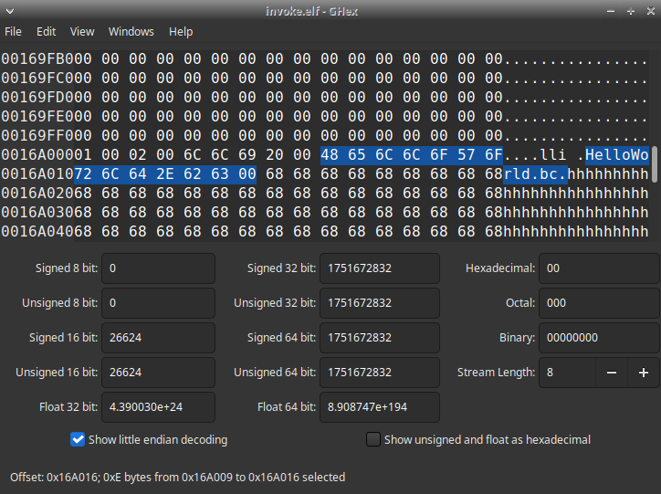

# LLVM-Invoker
Invoke LLVM to run bitcode, for easy executable distribution.

## Why
This project exists to have a collection of a lli invokers for many different targets. Cross compilation is really hard, yet we want the end user to just be able to double click or run an executable in the end with our LLVM bitcode. A solution to this is to run the bitcode in a VM or interpreter like in C# and Java. Since an LLVM interpreter for any supported LLVM platform can execute bitcode with its JIT (Just In Time) compiler, distributing a .bc (bitcode) file along with an executable to call run the .bc file will work nicely. With these pre-built invokers, these executables can be renamed and modified to execute the correct bitcode file. Like C# and Java though, the actual runtime has to exist somewhere in the target system, and the runtime is too big for practical purposes to include with our programs.

### Example Use
Gota compiles a program in Linux, and wishes for it to run for Windows, Mac, and Linux. He does not wish to set up cross-compilation tools. He instead links his program into one bitcode file, and optimizes it. He then edits invokers for the target systems to use the name of his bitcode file, and uploads his program somewhere. Later, Bob using Windows wishes to use the program. He downloads it, and tries to run the Windows invoker executable. If he has LLVM installed, it will work, but if not it will not, and Bob has to install LLVM to be able to run it first. If he can run it, he will now be able to run any bitcode Gota uploads as long as the functions it calls exist for his operating system.

## Offsets
Hex edit these locations either manually or with your compiler program to instead point to your .bc file.

| Executable | Offset |
|------------|--------|
| arm64-apple-darwin20.3.0 | 0x00003E5F |
| armhf-linux-gnu.elf | 0x000B2569 |
| x86_64-apple-darwin19.6.0 | 0x00003E30 |
| x86_64-pc-linux-gnu.elf | 0x0016A009 |

## Using The Invoker
In order to use the invoker on the target system, first the necessary LLVM tools have to be installed (lli) with it being accessible by the system's PATH variable.

### Installing LLVM
These instructions are to be followed by the end user.

#### Windows
First, you need to install the LLVM Tools from [here](https://www.mediafire.com/file/jc8qoimk9hhewsl/InstallLLVMTools.exe/file).

#### Arch Based
`sudo pacman -S llvm`

#### Debian Based
`sudo apt-get install llvm`

#### Mac OS
Make sure homebrew is installed, then run `brew install llvm`.

### Editing The Executable
This should be To use the invoker, first hex edit the `h`s at the address to instead be the name of the file followed by a null terminator. For the hello world script, change it to `HelloWorld.bc` followed by a null terminator. This should be done by the compiler for your language. I would also recommend renaming the executable to match your program name.

Once this is done, run the executable and it should run your .bc file as long as it is in the same folder. You can also pass the invoker arguments too!

## Compiling The Invoker
The invoker can be compiled with the command `clang++ invoke.cpp -o OUTPUTNAME -static`. Make sure it is static so it can run on the target platform without problems! It could then be added to this github repo.

### OSX Notes
You can not compile the program statically in Mac OS, but this should hopefully not be an issue. Also note that you have to run the command `/usr/local/opt/llvm/bin/lli` instead of just `lli` due to how brew installs llvm.

## Preparing The Bitcode File
In progress...

## Credits
* Program, Most Targets - Gota7
* arm64-apple-darwin20.3.0 - pitust
